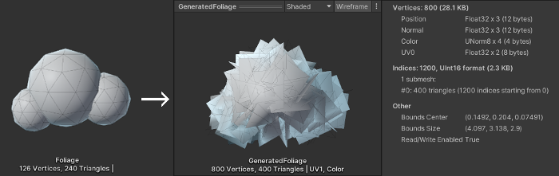

# Lab - Soft Foliage Shader Unity URP - Part 1
*A method for creating stylized soft (plane/intersecting quad geometry) foliage via an unlit shader in Unity URP. Although names of nodes and settings may differ, the methods discussed here will generally suit any live rendered pipeline (other game engines, 3D software etc)*

## Introduction
This shader is built for foliage meshes made from intersecting quads generated via a particle system. It uses adjusted normals for soft shading, alpha clipping from a texture for shaping, and subtle vertex movement to simulate wind.


## Additional Notes
- The shader is Unlit, uses an Opaque surface mode, and applies Alpha Clipping to mask out parts of the texture.
- It includes a "Main Light" subgraph from a third-party custom lighting function. You can add it via GitHub using the Package Manager (append ".git") or manually place the files into your project: [Cyanilux "Main Light" subgraph - Github](https://github.com/Cyanilux/URP_ShaderGraphCustomLighting)
- Shadows are disabled intentionally to prevent the quads from casting harsh shadows onto themselves, maintaining a soft, stylized look.

## Breakdown
### Foliage Mesh
Before diving into Shader Graph, we first need a suitable mesh. Intersecting quads are used here, allowing the foliage to look good from any angle. Other options like billboarding are possible but can feel artificial as quads rotate to face the camera.

To generate the mesh, we use Unity's Particle System. It can output quads as particles, which we then bake into a mesh using `ParticleSystemRenderer.BakeMesh`. In this lab, we’ll make a custom baking tool to explore parts of Unity useful for editor scripting.

### Particle System
1. Create an empty GameObject in the scene.
2. Add a Particle System component.
3. Configure it with:

   **Main Module:**
   - Looping: false
   - Start Lifetime: 999
   - Start Speed: 0
   - Start Size: 1
   - 3D Start Rotation: true (set Random Between Two Constants from 0 to 360 on each axis)
   - Max Particles: 200

   **Emission Module:**
   - Rate over Time: 0
   - One Burst of 200 particles

   **Shape Module:**
   - Shape: Mesh
   - Type: Triangle
   - Mesh: Use a custom mesh where each triangle spawns a quad
   - Normal Offset: -0.25
   - Adjust rotation/scale as needed

   **Renderer Module:**
   - Render Alignment: Local (prevents billboard behavior)

### Baking particle system to mesh (in stages)
We’ll now create a custom script that takes our particle system and bakes the output into a new Mesh asset. Instead of jumping straight to the full code, we’ll break this into manageable parts and explore what each section does and why it’s needed.

#### Step 1: Start the script and add essentials
Create a new C# script in your project and name it `BakeParticleSystemToMesh`. Open it and begin with the following:

```csharp
using UnityEngine;
#if UNITY_EDITOR
using UnityEditor;
using System.IO;
#endif
```

This brings in the Unity engine tools as usual. But we also have some new additions:
- `UnityEditor`: Only available in the editor (not in builds). It gives us access to editor-only tools like saving assets.
- `System.IO`: A .NET namespace for working with file systems. We'll use it to set up folder paths and file names.

The `#if UNITY_EDITOR` preprocessor directive ensures that editor-specific code doesn’t get compiled into the final game build. Anything inside this block will only run inside the Unity Editor.

#### Step 2: Set up the class
Next, add the following inside the script:

```csharp
[RequireComponent(typeof(ParticleSystem))]
public class BakeParticleSystemToMesh : MonoBehaviour {

    public string folderPath = "Meshes";
    public string fileName = "NewBakedParticleSystemMesh";
    public bool keepVertexColors = true;

    public enum NormalType {
        KeepNormals,
        NormalizedVertexPosition,
        ClearNormals
    }

    public NormalType handleNormals;
```

Let’s unpack what this does:
- `RequireComponent`: Automatically adds a Particle System to any GameObject that has this script.
- `folderPath` and `fileName`: Let us define where the mesh will be saved and what it's called.
- `keepVertexColors`: Lets us keep or discard vertex color data.
- `NormalType`: A simple menu to control how we handle normals on the baked mesh. Useful for shading decisions.

#### Step 3: Add the core function to bake the mesh
Still inside the class, add the following method:

```csharp
#if UNITY_EDITOR
    [ContextMenu("Bake To Mesh Asset")]
    public void SaveAsset() {
        Mesh mesh = new Mesh();
        GetComponent<ParticleSystemRenderer>().BakeMesh(mesh, true);

        if (!keepVertexColors)
            mesh.colors32 = null;
```

Here's what this part does:
- `ContextMenu`: Adds a right-click option in the Inspector so we can call this method easily.
- `BakeMesh`: This function captures the current particle simulation as a Mesh.
- `colors32 = null`: If we’re not keeping vertex colors, we clear them here to save memory.

#### Step 4: Handle normals based on the setting
Now let’s add logic to deal with the mesh normals, right after the vertex color check:

```csharp
        switch (handleNormals) {
            case NormalType.KeepNormals:
                break;
            case NormalType.NormalizedVertexPosition:
                Vector3[] normals = mesh.vertices;
                for (int i = 0; i < normals.Length; i++)
                    normals[i] = normals[i].normalized;
                mesh.normals = normals;
                break;
            case NormalType.ClearNormals:
                mesh.normals = null;
                break;
        }
```

This gives us flexibility when it comes to how shading behaves on our mesh. We can:
- Leave the normals alone.
- Replace them with the normalized vertex positions.
- Or remove them entirely.

#### Step 5: Save the baked mesh as an asset
Finally, we set up the save location and write out the mesh:

```csharp
        string fullPath = "Assets/" + folderPath;
        Directory.CreateDirectory(fullPath);
        string assetPath = fullPath + "/" + Path.GetFileNameWithoutExtension(fileName) + ".asset";

        Object existingAsset = AssetDatabase.LoadAssetAtPath<Object>(assetPath);
        if (existingAsset == null) {
            AssetDatabase.CreateAsset(mesh, assetPath);
        } else {
            if (existingAsset is Mesh meshAsset)
                meshAsset.Clear();
            EditorUtility.CopySerialized(mesh, existingAsset);
        }

        AssetDatabase.SaveAssets();
    }
#endif
}
```

This last section:
- Makes sure the save folder exists.
- Builds the path for saving the mesh.
- If the file already exists, it overwrites it safely.
- If not, it creates a brand new mesh asset.

By the end of this section, your `BakeParticleSystemToMesh` script should be fully functional.

### Final code example:
```C#
using UnityEngine;
#if UNITY_EDITOR
using UnityEditor;
using System.IO;
#endif

[RequireComponent(typeof(ParticleSystem))]
public class BakeParticleSystemToMesh : MonoBehaviour {

    public string folderPath = "Meshes";
    public string fileName = "NewBakedParticleSystemMesh";
    public bool keepVertexColors = true;

    public enum NormalType {
        KeepNormals,
        NormalizedVertexPosition,
        ClearNormals
    }

    public NormalType handleNormals;

#if UNITY_EDITOR
    [ContextMenu("Bake To Mesh Asset")]
    public void SaveAsset() {
        // Bake
        Mesh mesh = new Mesh();
        GetComponent<ParticleSystemRenderer>().BakeMesh(mesh, true);
        if (!keepVertexColors)
            mesh.colors32 = null;
        switch (handleNormals) {
            case NormalType.KeepNormals:
                break;
            case NormalType.NormalizedVertexPosition:
                Vector3[] normals = mesh.vertices;
                int length = normals.Length;
                for (int i = 0; i < length; i++) {
                    normals[i] = normals[i].normalized;
                }
                mesh.normals = normals;
                break;
            default:
            case NormalType.ClearNormals:
                mesh.normals = null;
                break;
        }

        // Setup Path
        string fileName = Path.GetFileNameWithoutExtension(this.fileName) + ".asset";
        Directory.CreateDirectory("Assets/" + folderPath);
        string assetPath = "Assets/" + folderPath + "/" + fileName;

        // Create / Override Asset
        Object existingAsset = AssetDatabase.LoadAssetAtPath<Object>(assetPath);
        if (existingAsset == null) {
            AssetDatabase.CreateAsset(mesh, assetPath);
        } else {
            if (existingAsset is Mesh)
                (existingAsset as Mesh).Clear();
            EditorUtility.CopySerialized(mesh, existingAsset);
        }
        AssetDatabase.SaveAssets();
    }
#endif
}
```

### Custom Inspector - Building Your First Editor Tool
To make the tool more user-friendly, let’s create a button in the Inspector. Save the following script in an `Editor` folder:

```C#
using UnityEngine;
using UnityEditor;

[CustomEditor(typeof(BakeParticleSystemToMesh))]
public class BakeParticleSystemToMeshEditor : Editor {
    public override void OnInspectorGUI() {
        base.OnInspectorGUI();

        if (GUILayout.Button("Bake")) {
            ((BakeParticleSystemToMesh)target).SaveAsset();
        }
    }
}
```

#### Why a custom editor?
This lets us extend the Unity Editor and add custom buttons, sliders, fields, or even entire tool windows. Here we:
- Add a "Bake" button to our component.
- Call the same function as before, but now accessible directly in the Inspector.

**From here, you can explore more advanced features like:**
- Previewing the baked mesh inside the editor.
- Adding validation for inputs (e.g., check if particle system is set up).
- Allowing drag-and-drop for folders or files.
- Exporting multiple variations of foliage with different densities or sizes.

### Generated mesh - other considerations
The baked mesh will appear in the specified folder within Assets. You can delete the particle system GameObject afterward, or keep it (maybe as a prefab) to create more foliage meshes later.

For soft shading, you have two main options: compute and store normals during baking (good for batching), or use the vertex position in the shader to compute them on the fly. Batching clears the model matrix, so if you plan to batch, bake the normals upfront using the Normalized Vertex Position option.



Getting consistent results depends on your mesh scale (in your 3D app), GameObject scale, and Particle System settings (like Start Size). Try to maintain correct scales throughout your pipeline. For example, if you're making a 1m x 1m bush in Blender, apply the scale before exporting and keep it consistent in Unity.

With the mesh ready, create a new GameObject, add a Mesh Renderer, and a Mesh Filter using your new foliage mesh. You're now ready to move on to building the shader!
