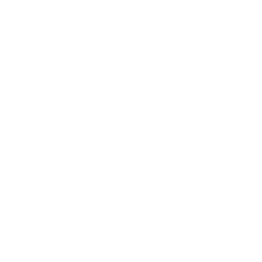
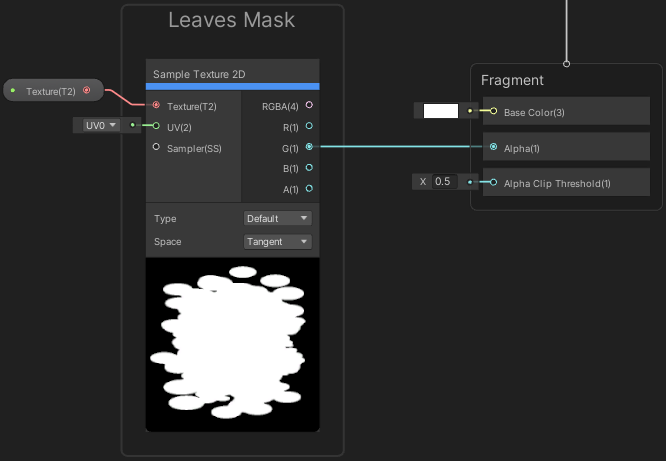
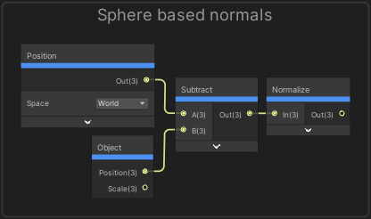
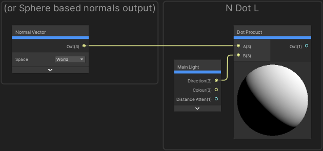
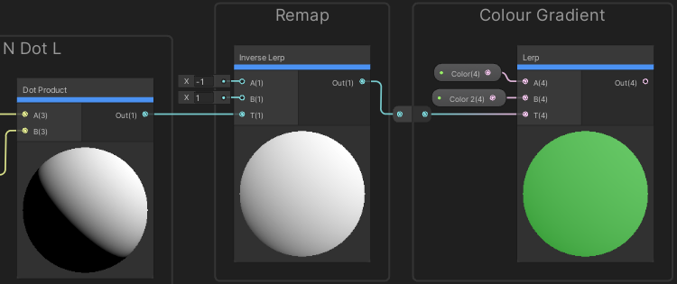
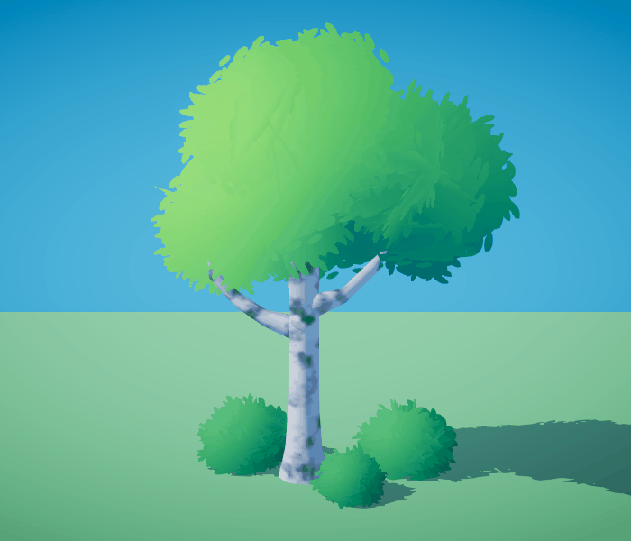
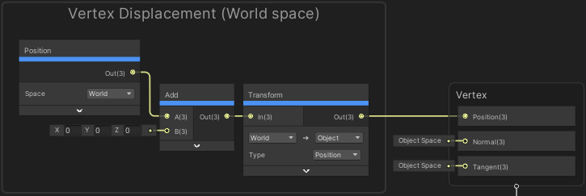
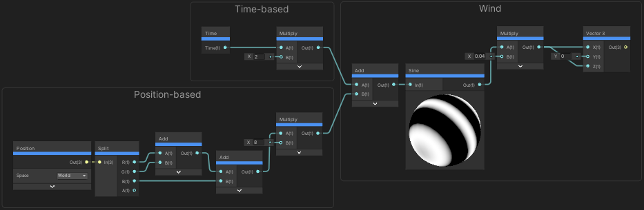

# Lab - Soft Foliage Shader Unity URP - Part 2
*A method for creating stylized soft (plane/intersecting quad geometry) foliage via an unlit shader in Unity URP. Although names of nodes and settings may differ, the methods discussed here will generally suit any live rendered pipeline (other game engines, 3D software etc)*

## Introduction
This shader is designed for foliage and is applied to a mesh comprising intersecting quads generated from a particle system. It incorporates modified normals to achieve soft shading, alpha clipping with a foliage texture, and a subtle amount of vertex displacement to simulate wind.

## Additional Notes
- This shader is Unlit, uses Opaque surface mode and Alpha Clipping to remove pixels and define foliage shape.
- It uses the "Main Light" subgraph from a third-party lighting setup, available via GitHub: [Cyanilux "Main Light" subgraph - Github](https://github.com/Cyanilux/URP_ShaderGraphCustomLighting)
- Shadows are intentionally turned off to avoid harsh self-shadowing from intersecting quads.
- If your project wasn’t created with URP, install it via Package Manager and assign a URP asset to the project. You may need to restart the editor. [Unity Documentation - Configuring URP](https://docs.unity3d.com/Packages/com.unity.render-pipelines.universal@7.1/manual/configuring-universalrp-for-use.html)

## Breakdown
### Shader Graph
We’ll create an **Unlit Shader Graph** and integrate custom lighting. These methods can apply to a Lit/PBR Graph as well.

In newer versions of Unity, the **Master Stack** replaces the old **Master Node**. It's now split into two main blocks:
- **Vertex Stage**: Handles mesh deformation like wind or dissolve effects.
- **Fragment Stage**: Handles color, transparency, and light interaction.

> If you're using Unity 2021 or later, you'll be using the Master Stack setup. Older versions like Unity 2019 may still use the Unlit Master node.

Start by creating a **Material** using your Shader Graph and assign it to the Mesh Renderer.

#### Step 1: Texture Setup
Create a `Texture2D` property for your foliage texture.
> Note the following texture may appear invisible on a browser if not viewed in dark mode (White splotch patterns on a transparent background)

Add a **Sample Texture 2D** node and connect the desired output channel (e.g., Green) to the **Alpha** port on the Master Stack.

> Why Green? When compressed, green often retains more data than red or blue. It’s also safe to use if all channels look similar in your texture.

You may also:
- Resize the texture
- Use alpha-only formats
- Convert to distance fields for better clipping results

#### Step 2: Enable Alpha Clipping
Ensure **Alpha Clipping** is enabled in the **Graph Inspector** (URP 10+).
- Set Alpha Clip Threshold to 0.5.
- Anything below this value (i.e., darker areas) gets clipped out.

This keeps the shader in **Opaque mode**, helping avoid common sorting issues with transparency.

### Shading
We’ll now recreate basic lighting using the **Lambert diffuse** approach.

#### Step 3: Normal Input
You have two options for normals:
- Use baked normals from the mesh with the **Normal Vector** node
- Or compute them in-shader by subtracting Object space from World Position, then normalizing the result

> Note: The second method may behave unexpectedly with static batching or particles, since transforms may be altered.

#### Step 4: Light Direction & Dot Product
Use the **Main Light Subgraph** (linked earlier) to get the light direction. Then:
- Use a **Dot Product** node to get brightness (based on angle between light and surface)

#### Step 5: Remap Brightness
Use an **Inverse Lerp** node to shift values from -1~1 to 0~1. This gives us smoother results suitable for foliage, which benefits from more subtle gradients.

#### Step 6: Apply Color
Use a **Lerp** node to blend between two Color properties using the result of your remapped dot product.
- Connect this to the **Base Color** of the Master Stack

Optional: Multiply the result by **Vertex Color** if you want to modulate based on vertex-painted data.

### Wind via Vertex Displacement
To simulate wind, we’ll subtly displace vertex positions.

> In Master Stack, vertex manipulation happens in the **Vertex Stage** via the **Position** port.

#### Step 7: Position Setup
Use a **Position (World)** node and an **Add** node to displace the position.

We apply the offset in **World space** and convert it back to **Object space** before sending it to the Position input. This keeps wind direction consistent regardless of rotation or scale.

#### Step 8: Sine Wave Motion
Use a **Sine** node to drive motion over time.
- Get a **Time** node and multiply to control speed
- Combine with Position (World) to vary movement across vertices (i.e., sway instead of shifting everything equally)
- Multiply output to reduce intensity (amplitude)

> Use a Vector1 property if you want this to be adjustable in the material.

Finally, put the result into a **Vector3**, then connect that into the Add node from Step 7.
- Typically, you'll only use X and Z (R and B) channels for ground-based plants like shrubs.

---

That wraps up the shader setup! You now have:
- Soft alpha-clipped foliage
- Custom lighting
- Wind sway through vertex displacement

You can continue to iterate with color tinting, per-object variation (via MaterialProperty blocks), or integrate this into a full foliage rendering system.
